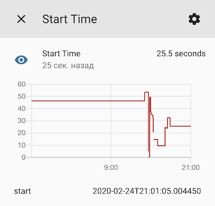

# StartTime

[](https://github.com/custom-components/hacs)

Create Start Time sensor for Home Assistant



## Config

From GUI:

> Configuration > Integrations > Add Integration > **Start Time**

or in YAML:

```yaml
start_time:
```

This component does not depend on the settings of the `logger` component!

## About

Home Assistant displays initialization time in INFO logs. The component shows the same time as a sensor.

Useful for debugging performance of slow computers like Raspberry Pi.

```
2020-02-24 17:13:11 INFO (MainThread) [homeassistant.bootstrap] Home Assistant initialized in 25.5s
```
